# Agente de Atendimento n8n

Workflow n8n para atendimento automatizado via WhatsApp, com qualificacao de leads, consulta/registro em Google Sheets e uso de modelos OpenAI.

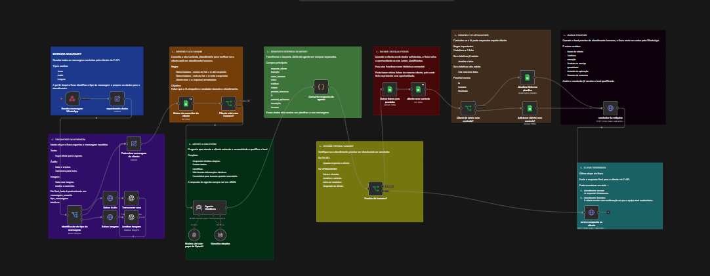

## Conteudo

- `Agente de Atendimento especialiizado.json`: export sanitizado do workflow n8n.
- `.env.example`: lista dos valores que precisam ser configurados no ambiente/n8n.
- `docs/images/`: imagens de documentacao do workflow.

## Visao geral

O fluxo recebe mensagens do WhatsApp via Z-API, identifica se o cliente enviou texto, audio ou imagem, padroniza a mensagem e consulta uma planilha de controle para decidir se a IA deve responder ou se o atendimento esta com humano.

Quando a IA responde, o agente qualifica o lead, coleta dados importantes e retorna uma resposta estruturada em JSON. Se o caso precisar de atendimento humano, o workflow registra a oportunidade no Google Sheets, atualiza o controle e avisa o vendedor.

## Etapas do workflow

### 1. Entrada WhatsApp

Recebe mensagens do cliente via Z-API e prepara os dados iniciais.

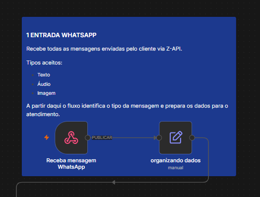

### 2. Tratamento da mensagem

Identifica texto, audio ou imagem, baixa midias quando necessario e padroniza a mensagem para o agente.

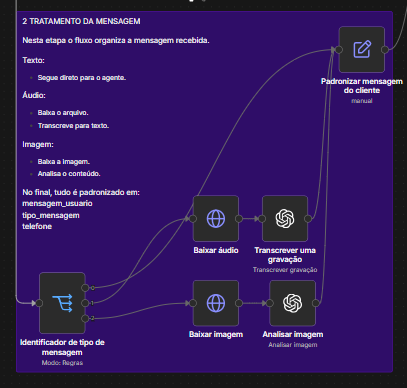

### 3. Controle IA x humano

Consulta o controle de atendimento para evitar que a IA responda enquanto o vendedor esta conduzindo a conversa.

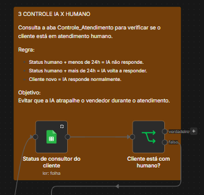

### 4. Agente IA Moldform

Atende o cliente, identifica a intencao, coleta dados e gera resposta estruturada.

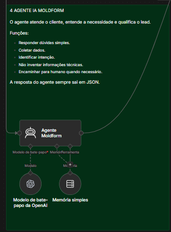

### 5. Converter resposta do agente

Transforma o JSON retornado pelo agente em campos separados para uso nas proximas etapas.

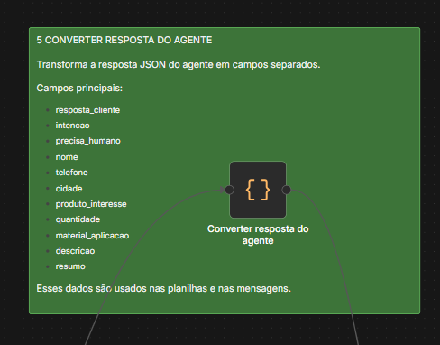

### 6. Decisao: precisa humano?

Decide se o fluxo apenas responde o cliente ou se deve salvar lead, atualizar controle e avisar vendedor.

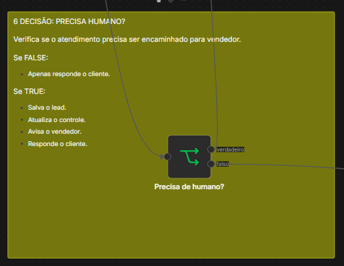

### 7. Salvar lead qualificado

Registra oportunidades qualificadas na planilha de leads.

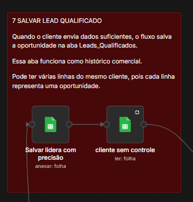

### 8. Controle de atendimento

Atualiza ou cria a linha do cliente no controle de atendimento.

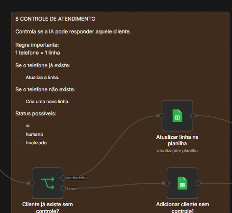

### 9. Avisar vendedor

Envia um aviso pelo WhatsApp quando o lead precisa de atendimento humano.

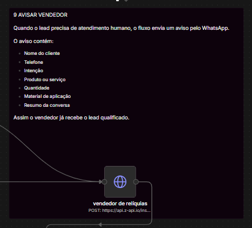

### 10. Responder cliente

Envia a resposta final ao cliente via Z-API.

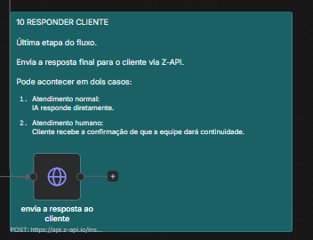

## Antes de importar

Este repositorio nao contem credenciais reais. Os valores sensiveis foram substituidos por placeholders:

- `REPLACE_WITH_ZAPI_INSTANCE_ID`
- `REPLACE_WITH_ZAPI_TOKEN`
- `REPLACE_WITH_GOOGLE_SHEET_ID`
- `REPLACE_WITH_OPENAI_CREDENTIAL_ID`
- `REPLACE_WITH_GOOGLE_SHEETS_CREDENTIAL_ID`
- `REPLACE_WITH_N8N_WEBHOOK_ID`
- `REPLACE_WITH_SELLER_WHATSAPP_NUMBER`
- `REPLACE_WITH_N8N_INSTANCE_ID`

Depois de importar o workflow no n8n, recrie ou selecione as credenciais reais dentro do proprio n8n.

## Seguranca

Nao publique tokens, chaves de API, arquivos `.env`, exports com credenciais reais ou URLs contendo tokens.

Antes de publicar alteracoes, rode uma busca por termos sensiveis como `token`, `secret`, `password`, `senha`, `authorization` e `api_key`.
